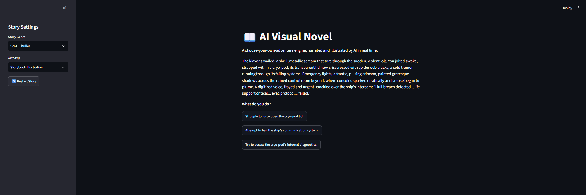

# AI Visual Novel

## Preview



A "choose your own adventure" engine that combines stateful text generation (Gemini), structured JSON parsing, dynamically generated UI, AI image generation (Pollinations), and text-to-speech narration (gTTS) in one Streamlit app.

## Features

- **AI-driven storytelling**: Gemini writes each scene as strict JSON with narrative text, an image prompt, and 2 to 3 choices.
- **Dynamic choice buttons**: The UI generates a fresh set of buttons for each scene based on what the AI returns.
- **Illustrated scenes**: Each scene is rendered as an AI-generated image via Pollinations.
- **Spoken narration**: Every scene's text is converted to audio with gTTS and played inline with `st.audio()`.
- **Persistent state**: Story, image, and audio all persist across reruns using `st.session_state`.
- **Graceful failure handling**: If the image API or TTS fails, the app shows a toast notification and keeps the story going.

## Setup

1. **Clone or copy this folder** to your machine.

2. **Create a virtual environment** (optional but recommended):
   ```bash
   python -m venv .venv
   .\.venv\Scripts\activate   # Windows
   # source .venv/bin/activate  # macOS/Linux
   ```

3. **Install dependencies**:
   ```bash
   pip install -r requirements.txt
   ```

4. **Set your Google AI API key**:
   - Copy the example file and rename it to `.env`:
     ```bash
     copy .env.example .env   # Windows CMD
     # or
     cp .env.example .env     # macOS/Linux
     ```
   - Edit `.env` and add your actual Gemini API key:
     ```env
     API_KEY=your_actual_gemini_api_key_here
     ```

5. **Run the app**:
   ```bash
   streamlit run app.py
   ```
   The app will open at `http://localhost:8501` or another port if specified.

## Usage

1. Pick a **Story Genre** and **Art Style** in the sidebar.
2. Click **Start Adventure** to generate the opening scene, its illustration, and its narration.
3. Click one of the dynamically generated choice buttons to continue the story.
4. Use **Restart Story** in the sidebar at any time to begin a new adventure.

## How It Works

- **JSON Engine**: The Gemini system prompt strictly instructs the model to return only a JSON object with `story_text`, `image_prompt`, and `options` keys.
- **Dynamic UI**: A `for` loop iterates over the `options` list and creates one `st.button()` per choice.
- **Image + Audio**: The `image_prompt` is sent to Pollinations, and `story_text` is sent to gTTS to generate spoken narration.
- **Failure handling**: External API calls are wrapped in `try/except` so the app can continue gracefully.

## Requirements

See `requirements.txt` for exact dependencies.

## License

This project is for educational and demo purposes. Feel free to modify and share.
